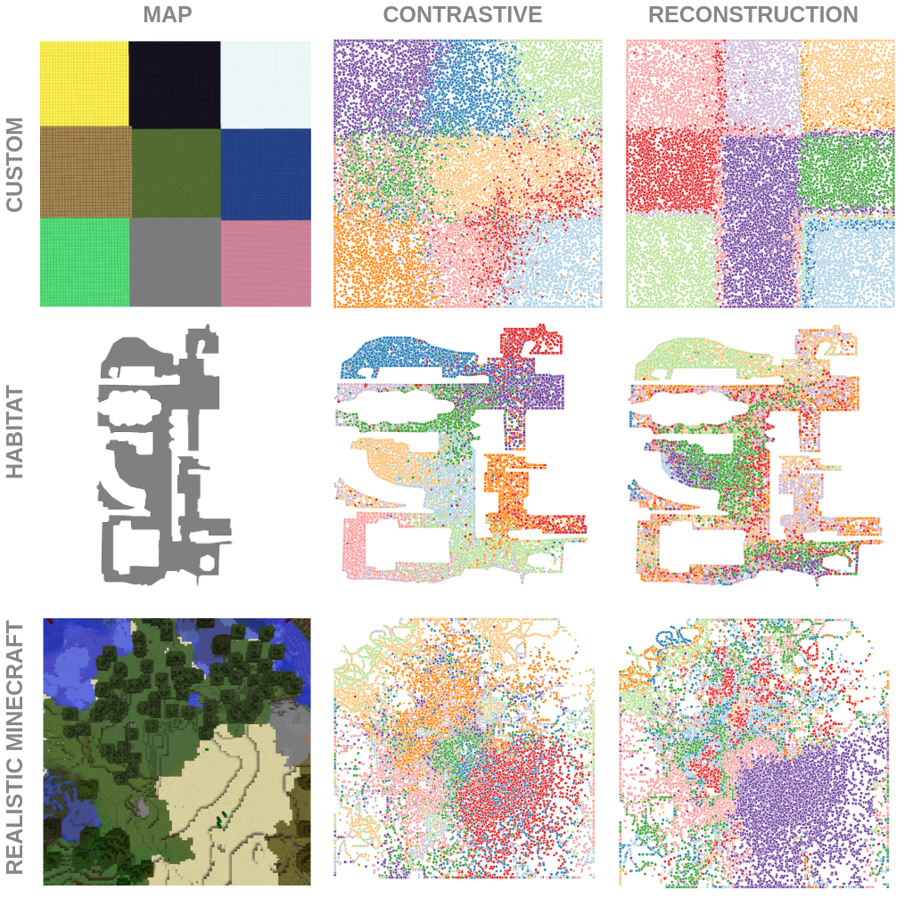
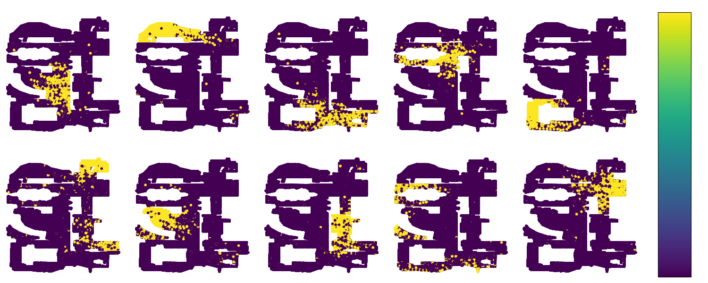
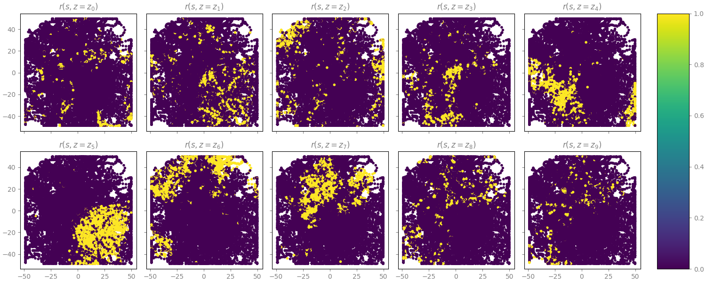
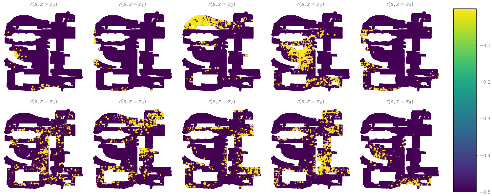
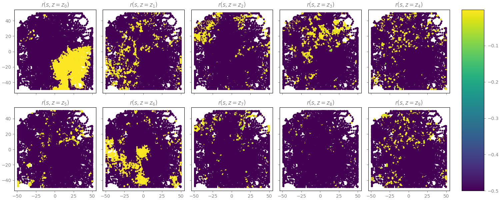

We complete the results in the extended abstract with these [Weights & Biases](https://wandb.ai/site) reports:

### [Discovered skills](https://wandb.ai/embodied-rl-agents/cvpr-workshop/reports/PixelEDL-results-comparison-Index-maps--Vmlldzo2NzYyMDA)

 

 
 

### [Reward distribution at the Learning stage](https://wandb.ai/embodied-rl-agents/cvpr-workshop/reports/PixelEDL-results-comparison-Reward-maps--Vmlldzo2NzYyMTM)

#### CURL
 
 

#### VQ-VAE
 
 
